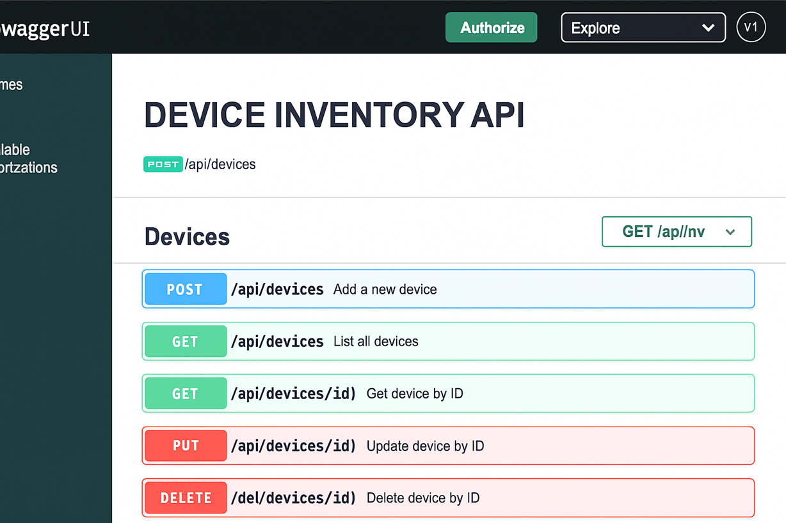

# Device Inventory API (Java • Spring Boot)

A REST API to manage a small **device inventory**, inspired by EMS/NMS workflows.  
Built with **Java 17, Spring Boot 3, Gradle, JPA (H2), Swagger/OpenAPI**.

---

## 🚀 Features
- CRUD endpoints for devices
- Validation (status = `ONLINE|OFFLINE|MAINTENANCE`, IPv4 address format)
- In-memory H2 database (no external setup)
- OpenAPI/Swagger UI at `/swagger-ui.html`
- Unit tests with MockMvc
- GitHub Actions CI (Gradle build + test + JaCoCo report)

---

## 📚 API Endpoints

| Method | Endpoint          | Description              |
|--------|------------------|--------------------------|
| POST   | `/api/devices`   | Create a new device      |
| GET    | `/api/devices`   | List all devices         |
| GET    | `/api/devices/{id}` | Get device by ID      |
| PUT    | `/api/devices/{id}` | Update device by ID   |
| DELETE | `/api/devices/{id}` | Delete device by ID   |

---


## 🔧 Quickstart

```bash
# Ensure Java 17+ and Gradle are installed
java -version
gradle -v

# Run tests
gradle test

# Start the app
gradle bootRun
```

Visit:

Swagger UI: http://localhost:8080/swagger-ui.html
H2 Console (optional): http://localhost:8080/h2-console


Create a Device
```bash
curl -X POST http://localhost:8080/api/devices \
  -H "Content-Type: application/json" \
  -d '{
    "name": "Core Router",
    "serialNumber": "SN-123",
    "type": "router",
    "status": "ONLINE",
    "ipAddress": "10.0.0.1"
  }'
```

List Devices
```bash
curl http://localhost:8080/api/devices/1
```

Get Device by ID
```bash
curl http://localhost:8080/api/devices/1
```

Update Device
```bash
curl -X PUT http://localhost:8080/api/devices/1 \
  -H "Content-Type: application/json" \
  -d '{
    "name": "Core Router",
    "serialNumber": "SN-123",
    "type": "router",
    "status": "MAINTENANCE",
    "ipAddress": "10.0.0.1"
  }'
```

Delete Device
```bash
curl -X DELETE http://localhost:8080/api/devices/1
```

📸 Swagger UI Screenshot



[](LICENSE)
